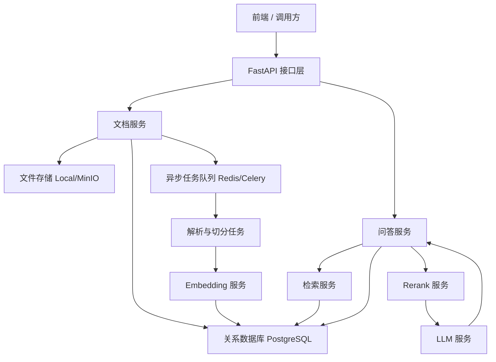
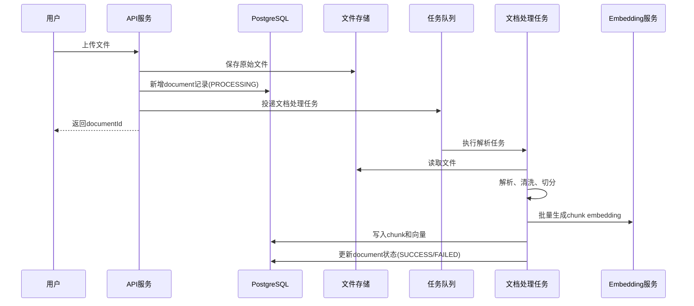
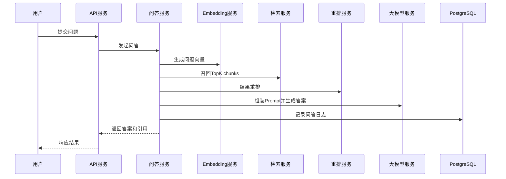

# RAG 知识库问答系统技术方案文档

## 1. 文档信息

**项目名称：** 企业知识库智能问答系统（RAG）  
**文档版本：** V1.0  
**文档类型：** 技术方案说明书  
**适用对象：** 开发、测试、面试展示、项目复盘  
**关联文档：** `RAG知识库问答系统需求文档.md`

---

## 2. 建设目标

基于 PRD，本方案目标是在 V1 阶段落地一个可运行、可演示、可扩展的 RAG 系统，满足以下要求：

1. 打通完整链路：文档上传、解析、切分、向量化、检索、重排、问答生成、引用返回；
2. 支持单用户知识库管理与基础问答；
3. 提供清晰的模块边界，便于后续扩展为多用户、多知识库和多租户架构；
4. 兼顾开发效率、系统稳定性和面试展示的工程完整性。

---

## 3. 总体设计原则

### 3.1 设计原则

1. **先跑通主链路**：V1 优先保证上传到问答的核心闭环稳定可用；
2. **模块可替换**：Embedding 模型、向量库、重排器、大模型应支持后续替换；
3. **存算分离**：关系型数据、原始文件、向量索引职责分离；
4. **异步化处理**：文档入库链路采用异步任务，避免上传接口阻塞；
5. **可追踪**：关键操作、任务状态、请求耗时、异常信息可记录可排查；
6. **低幻觉优先**：Prompt、检索策略、拒答策略围绕“基于资料回答”设计。

### 3.2 V1 关键取舍

1. 单体后端优先，不拆微服务；
2. 单知识库模型优先，多知识库通过字段预留；
3. OCR、复杂权限、工作流 Agent 暂不纳入；
4. 优先文本型 PDF，不处理扫描版 PDF；
5. 优先使用成熟开源组件，降低实现复杂度。

---

## 4. 技术选型建议

## 4.1 推荐技术栈

为兼顾开发效率、生态成熟度和 RAG 集成便利性，建议采用以下技术栈：

- **后端框架：** Python + FastAPI
- **ORM / 数据库访问：** SQLAlchemy
- **关系型数据库：** PostgreSQL
- **向量检索：** PostgreSQL + pgvector
- **异步任务：** Celery 或 FastAPI BackgroundTasks
- **消息中间件：** Redis
- **文件存储：** 本地文件系统（V1），后续可迁移 MinIO / OSS / S3
- **文档解析：**
  - txt / md：原生读取
  - pdf：`pypdf`
  - docx：`python-docx`
- **Embedding 模型：** 可配置外部 Embedding API
- **重排模型：** V1 可先采用简单分数排序，V1.1 引入独立 rerank 模型
- **大模型调用：** 可配置外部 LLM API
- **日志：** Python `logging` 或 `loguru`
- **配置管理：** `.env` + `pydantic-settings`

## 4.2 选型原因

1. FastAPI 适合快速构建标准 REST API，接口文档清晰；
2. Python 在文档解析、模型集成、向量检索生态方面成熟；
3. PostgreSQL + pgvector 能减少系统组件数量，适合 V1；
4. Redis + 异步任务可避免上传即阻塞处理；
5. 模型层采用适配器模式，便于后续替换不同厂商能力。

## 4.3 可替代方案

- 向量库可替换为 Milvus / Qdrant / Elasticsearch；
- 异步任务可从 BackgroundTasks 升级到 Celery；
- 文件存储可从本地迁移到对象存储；
- 检索策略可从纯向量检索升级为混合检索。

---

## 5. 系统架构设计

## 5.1 总体架构

系统采用“单体应用 + 异步任务 + 向量检索”的分层架构：

1. **API 层**：接收前端请求，负责参数校验、鉴权预留、统一响应；
2. **业务层**：封装文档管理、检索问答、引用组织等核心业务逻辑；
3. **任务层**：负责文档解析、切分、向量化等耗时任务；
4. **数据层**：保存文档元数据、chunk 数据、问答记录和向量索引；
5. **模型接入层**：统一封装 Embedding、Rerank、LLM 调用；
6. **存储层**：保存原始上传文件。

## 5.2 逻辑架构图



## 5.3 分层职责

### API 层

- 接收上传、列表、删除、问答、历史查询请求；
- 进行参数校验、错误码映射、统一返回；
- 注入请求 ID，记录访问日志。

### 业务层

- 管理文档状态流转；
- 组织文档入库流程；
- 执行检索、重排、Prompt 构建与答案组装；
- 统一处理拒答逻辑和引用输出。

### 任务层

- 异步解析文档；
- 清洗文本并切分 chunk；
- 批量生成 embedding；
- 写入 chunk 与向量信息；
- 更新文档处理状态。

### 模型接入层

- 提供统一 Embedding / Rerank / LLM 接口；
- 屏蔽不同厂商 API 差异；
- 支持超时、重试、熔断和指标记录。

---

## 6. 核心业务流程设计

## 6.1 文档入库流程



### 入库步骤说明

1. 上传接口先校验文件格式、大小和文件名；
2. 原始文件保存到本地目录，例如 `storage/uploads/`；
3. 写入 `document` 表，状态初始化为 `PROCESSING`；
4. 异步任务读取文件并执行解析；
5. 解析后的文本进入清洗与切分流程；
6. chunk 批量调用 embedding 接口；
7. chunk 文本、元数据和向量写入数据库；
8. 成功后更新文档状态和 chunk 数量，失败则记录错误原因。

## 6.2 问答流程



### 问答步骤说明

1. 校验问题长度和文档范围；
2. 对问题生成 embedding；
3. 基于向量相似度检索 TopK chunk；
4. 对候选 chunk 进行重排或规则打分；
5. 选取前 N 条构造上下文；
6. 注入系统 Prompt，要求模型基于资料回答；
7. 若相关度不足则触发拒答；
8. 返回答案、引用、相关片段和请求耗时；
9. 记录问答结果与状态。

---

## 7. 模块设计

## 7.1 文档管理模块

### 功能

- 上传文档
- 查询文档列表
- 删除文档
- 查询处理状态

### 设计要点

1. 上传成功只代表文件接收成功，不代表解析完成；
2. 删除操作需同步删除文件、chunk、向量及元数据；
3. 删除失败时记录异常并支持补偿；
4. 文档状态使用明确枚举值控制流程。

## 7.2 文档解析模块

### 解析策略

- `txt`：直接读取文本
- `md`：直接读取并保留标题结构
- `pdf`：提取文本页内容，记录页码
- `docx`：提取段落正文，尽量保留标题层级

### 异常处理

- 空文本
- 文件损坏
- 编码异常
- 非文本型 PDF

## 7.3 文本清洗与切分模块

### 清洗规则

1. 标准化换行符为 `\n`；
2. 合并多余空白行；
3. 去除明显噪声字符；
4. 尽可能保留标题和段落边界；
5. 保留页码、章节标题等引用定位信息。

### 切分策略

V1 推荐采用“按段落优先 + 固定长度兜底”的混合切分策略：

1. 先按标题或段落做粗分；
2. 对超长段落按字符长度切分；
3. 设置 overlap 保证上下文连续性；
4. 为每个 chunk 保留顺序编号和来源信息。

### 默认参数建议

- `chunk_size`: 600
- `chunk_overlap`: 80
- `retrieve_top_k`: 10
- `final_context_k`: 4

## 7.4 向量化模块

### 设计要点

1. 文档向量化采用批量调用，降低接口开销；
2. embedding 向量维度不写死，以配置项读取；
3. 向量化失败支持有限重试；
4. 记录每次调用耗时和失败原因。

### 接口抽象示例

```python
class EmbeddingProvider:
    def embed_query(self, text: str) -> list[float]:
        ...

    def embed_documents(self, texts: list[str]) -> list[list[float]]:
        ...
```

## 7.5 检索与重排模块

### 检索策略

V1 采用纯向量检索，后续再扩展混合检索：

1. 对问题生成向量；
2. 在 `document_chunk` 中执行向量相似度检索；
3. 支持按 `document_id` 过滤；
4. 返回相似度分数和 chunk 元数据。

### 重排策略

V1 可采用以下两层方案：

1. 基于向量分数排序；
2. 加入简单规则修正，例如标题命中、关键词覆盖度、chunk 长度惩罚。

V1.1 再替换为独立 rerank 模型。

## 7.6 问答生成模块

### Prompt 设计原则

1. 明确要求“仅基于提供资料回答”；
2. 若资料不足，必须拒答；
3. 输出答案时附带引用编号；
4. 避免模型自由发挥和扩展推断。

### 系统 Prompt 示例

```text
你是企业知识库问答助手。请严格基于提供的参考资料回答问题。
如果参考资料不足以支持结论，请明确回复“知识库暂无足够依据”。
不要编造不存在的信息，不要使用资料外常识补全关键事实。
回答时先给出简洁结论，再列出依据，并返回对应引用编号。
```

### 输出结构

```json
{
  "requestId": "req_xxx",
  "question": "退款规则是什么？",
  "answer": "根据知识库内容，退款申请将在 3 个工作日内处理完成。",
  "citations": [
    {
      "documentId": 123,
      "fileName": "售后说明书.pdf",
      "chunkIndex": 4,
      "pageNo": 2,
      "content": "退款申请提交后，系统将在 3 个工作日内审核处理。"
    }
  ],
  "relatedChunks": [],
  "elapsedTimeMs": 1820
}
```

## 7.7 问答记录模块

### 记录内容

- 请求 ID
- 问题内容
- 最终答案
- 命中 chunks
- 模型名称
- 响应耗时
- 状态
- 创建时间

### 设计目的

1. 支持历史查询；
2. 支持故障排查；
3. 支持后续评估问答质量；
4. 为面试展示提供完整工程闭环。

---

## 8. 数据存储设计

## 8.1 存储划分

### 关系数据库

存储业务元数据：

- 文档信息
- chunk 信息
- 问答记录
- 处理状态和错误信息

### 文件存储

存储原始上传文件：

- 本地目录 `storage/uploads/`
- 按日期或 UUID 分层

### 向量存储

V1 直接复用 PostgreSQL + pgvector，在 `document_chunk` 表中存储向量字段。

## 8.2 表结构建议

### document

| 字段 | 类型 | 说明 |
|---|---|---|
| id | bigint | 主键 |
| file_name | varchar | 原始文件名 |
| file_type | varchar | 文件类型 |
| file_path | varchar | 文件存储路径 |
| file_size | bigint | 文件大小 |
| status | varchar | PROCESSING/SUCCESS/FAILED/DELETED |
| error_message | text | 失败原因 |
| chunk_count | int | chunk 数量 |
| created_time | timestamp | 创建时间 |
| updated_time | timestamp | 更新时间 |

### document_chunk

| 字段 | 类型 | 说明 |
|---|---|---|
| id | bigint | 主键 |
| document_id | bigint | 文档 ID |
| chunk_index | int | chunk 顺序 |
| chunk_text | text | chunk 文本 |
| page_no | int | 页码，可空 |
| section_title | varchar | 章节标题，可空 |
| embedding_vector | vector | 向量字段 |
| metadata_json | jsonb | 扩展元数据 |
| created_time | timestamp | 创建时间 |

### qa_record

| 字段 | 类型 | 说明 |
|---|---|---|
| id | bigint | 主键 |
| request_id | varchar | 请求唯一标识 |
| question | text | 用户问题 |
| answer | text | 生成答案 |
| citations_json | jsonb | 引用结果 |
| top_chunks_json | jsonb | 检索结果 |
| model_name | varchar | 模型名称 |
| response_time_ms | int | 响应耗时 |
| status | varchar | SUCCESS/FAILED/TIMEOUT |
| created_time | timestamp | 创建时间 |

## 8.3 索引建议

1. `document.status`
2. `document.created_time`
3. `document_chunk.document_id`
4. `qa_record.request_id`
5. `qa_record.created_time`
6. `document_chunk.embedding_vector` 向量索引

---

## 9. 接口设计方案

## 9.1 通用响应结构

```json
{
  "code": 0,
  "message": "success",
  "data": {}
}
```

错误响应：

```json
{
  "code": 40001,
  "message": "unsupported file type",
  "data": null
}
```

## 9.2 接口列表

### 1. 上传文档

- `POST /api/documents/upload`
- 入参：`multipart/form-data`
- 出参：文档 ID、状态

### 2. 查询文档列表

- `GET /api/documents`
- 支持按状态、时间分页查询

### 3. 查询文档详情

- `GET /api/documents/{id}`
- 返回文档信息、状态、chunk 数量、错误信息

### 4. 删除文档

- `DELETE /api/documents/{id}`
- 返回删除结果

### 5. 发起问答

- `POST /api/qa/ask`
- 入参：问题、文档范围
- 出参：答案、引用、耗时

### 6. 查询问答历史

- `GET /api/qa/history`
- 支持按时间倒序分页

---

## 10. 状态机与任务控制

## 10.1 文档状态流转

```text
PROCESSING -> SUCCESS
PROCESSING -> FAILED
SUCCESS -> DELETED
FAILED -> DELETED
```

## 10.2 问答状态流转

```text
RUNNING -> SUCCESS
RUNNING -> FAILED
RUNNING -> TIMEOUT
```

## 10.3 异步任务建议

### V1 最简实现

- 上传完成后使用后台任务处理文档；
- 适合单机演示和本地开发。

### V1 推荐实现

- 使用 Celery + Redis 处理文档入库任务；
- 支持失败重试、任务监控和后续横向扩展。

---

## 11. 异常处理设计

## 11.1 上传异常

- 文件格式不支持
- 文件为空
- 文件过大
- 文件名非法

## 11.2 解析异常

- PDF 无法提取文本
- DOCX 文件损坏
- 编码识别失败
- 清洗后无有效内容

## 11.3 向量化异常

- Embedding 接口超时
- Embedding 接口失败
- 返回向量维度异常

## 11.4 问答异常

- 检索无结果
- 模型超时
- 模型返回空答案
- 引用无法映射

## 11.5 异常处理原则

1. 统一错误码；
2. 对外返回友好错误信息；
3. 对内记录详细堆栈与上下文；
4. 每个关键请求绑定 `request_id`；
5. 任务失败时落库错误原因。

---

## 12. 安全与治理设计

## 12.1 文件安全

1. 校验 MIME 和扩展名；
2. 重命名上传文件，避免目录穿越；
3. 限制最大文件大小；
4. 禁止执行型文件上传。

## 12.2 接口安全

1. V1 可先不做复杂鉴权，但需预留认证中间件；
2. 增加基础限流能力；
3. 输入参数统一校验和清洗。

## 12.3 日志与审计

1. 记录上传、删除、问答等关键操作；
2. 记录模型调用耗时和状态；
3. 记录文档处理失败原因；
4. 避免日志中输出完整敏感原文。

---

## 13. 性能与扩展设计

## 13.1 性能优化建议

1. 文档切分与向量化批处理；
2. 只在问答时取 TopK 结果，避免上下文过长；
3. 对文档列表和历史记录做分页；
4. 对高频查询加索引；
5. 模型调用设置超时和重试上限。

## 13.2 扩展路线

### V1.1

- 混合检索
- 独立 rerank 模型
- 更精细的 chunk 策略
- 答案流式返回

### V2

- 多用户
- 多知识库
- 权限管理
- 对象存储
- OCR 支持
- 质量评估与监控看板

---

## 14. 项目目录结构建议

```text
rag/
├── app/
│   ├── api/
│   │   ├── document.py
│   │   └── qa.py
│   ├── core/
│   │   ├── config.py
│   │   ├── logger.py
│   │   └── exceptions.py
│   ├── db/
│   │   ├── base.py
│   │   ├── models/
│   │   └── repositories/
│   ├── schemas/
│   ├── services/
│   │   ├── document_service.py
│   │   ├── ingest_service.py
│   │   ├── retrieval_service.py
│   │   └── qa_service.py
│   ├── providers/
│   │   ├── embedding/
│   │   ├── rerank/
│   │   └── llm/
│   ├── tasks/
│   │   └── document_tasks.py
│   ├── utils/
│   │   ├── file_parser.py
│   │   ├── text_cleaner.py
│   │   └── text_splitter.py
│   └── main.py
├── storage/
│   └── uploads/
├── tests/
├── .env
├── requirements.txt
└── README.md
```

---

## 15. 开发实施计划

## 15.1 第一阶段：基础骨架

1. 初始化 FastAPI 项目；
2. 配置 PostgreSQL、pgvector、Redis；
3. 建立基础目录结构、配置管理、日志体系；
4. 创建数据库表和基础模型。

## 15.2 第二阶段：文档入库链路

1. 实现上传接口；
2. 实现文件保存与元数据入库；
3. 实现解析、清洗、切分；
4. 实现 embedding 和 chunk 入库；
5. 完成文档状态流转。

## 15.3 第三阶段：问答链路

1. 实现问题 embedding；
2. 实现向量检索；
3. 实现 Prompt 组装；
4. 实现 LLM 调用；
5. 实现答案引用和问答历史记录。

## 15.4 第四阶段：联调与验收

1. 补充统一异常处理；
2. 完善日志和错误码；
3. 完成接口联调；
4. 按 PRD 验收标准自测。

---

## 16. 测试方案建议

## 16.1 单元测试

- 文件格式校验
- 文档解析逻辑
- 文本切分逻辑
- Prompt 组装逻辑
- 引用映射逻辑

## 16.2 集成测试

- 上传到入库完整链路
- 问答完整链路
- 删除文档后数据清理
- 异常场景回归

## 16.3 验收测试

- 文档成功上传并处理完成
- 问题可获得基于知识库的回答
- 返回至少一个引用来源
- 无依据问题触发拒答

---

## 17. 风险与应对

## 17.1 主要风险

1. PDF 文本提取质量不稳定；
2. chunk 切分不合理导致召回效果差；
3. embedding 与 LLM 响应时间偏长；
4. 大模型未严格遵守“基于资料回答”；
5. 删除和失败补偿逻辑不完善导致脏数据。

## 17.2 应对方案

1. V1 限定文本型 PDF；
2. 保留 chunk 参数配置能力，方便调优；
3. 加超时、重试、日志与耗时指标；
4. 强化 Prompt 和拒答阈值；
5. 使用状态机和补偿日志保证一致性。

---

## 18. 结论

本方案采用“FastAPI + PostgreSQL/pgvector + Redis + 异步任务 + 外部模型服务”的实现路径，能够在 V1 阶段较低成本地完成企业知识库问答系统的核心能力建设。方案强调主链路可用、模块边界清晰、模型与存储可替换，既适合实际开发，也适合作为项目展示与后续扩展基础。
