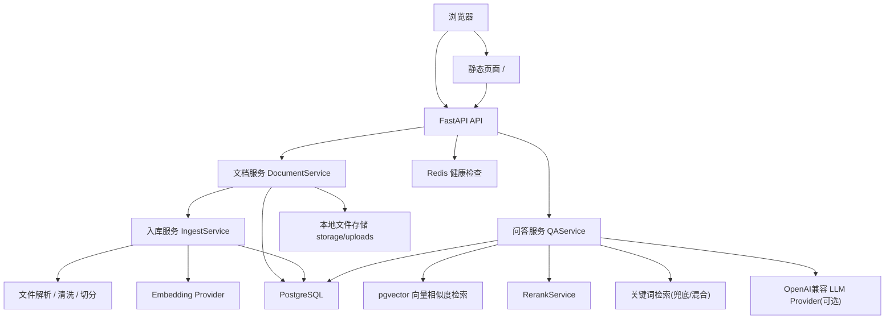
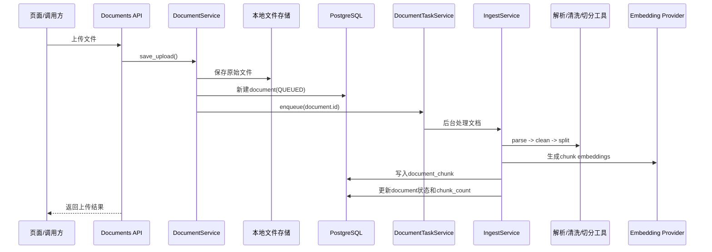
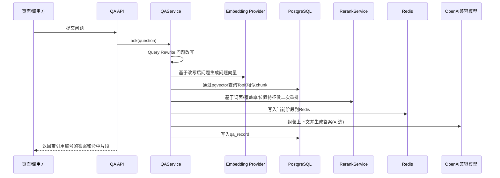
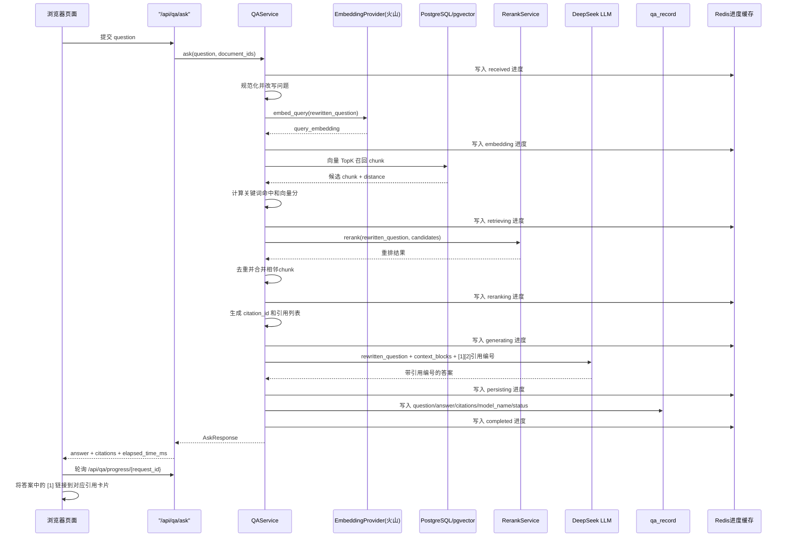
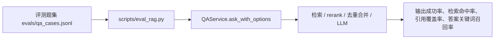

# 当前项目架构说明

## 1. 文档目的

本文档描述当前仓库已经实现的实际架构，而不是目标架构。  
后续新增功能、调整模块边界、引入新基础设施时，需要同步更新本文档，确保它始终反映项目真实状态。

更新原则：

1. 新增接口时，更新“接口层”和“请求链路”；
2. 新增服务或模块时，更新“代码分层”和“目录结构”；
3. 新增数据库表、字段或状态流转时，更新“数据层”；
4. 新增前端页面或交互时，更新“前端层”；
5. 新增异步任务、向量检索、问答链路时，更新“整体架构图”和“核心流程”。

---

## 2. 当前整体架构

当前项目采用“本地 FastAPI 单体应用 + 云端 PostgreSQL/Redis + 本地静态页面”的实现方式。



---

## 3. 当前功能边界

### 已完成

1. 健康检查页面与接口；
2. 文档上传；
3. 文档列表查询；
4. 文档详情查询；
5. 文档删除；
6. 文档重新处理；
7. 原始文件本地保存；
8. `txt/md/pdf/docx` 基础解析；
9. 文本清洗；
10. 文本切分；
11. chunk 数据落库；
12. 页面端可直接操作上传、刷新、删除、重新处理；
13. chunk 向量生成与落库；
14. 基于向量相似度和关键词的混合检索；
15. 问答历史记录落库；
16. 页面端可直接提问并查看命中片段；
17. 配置 `LLM_API_KEY` 后可选启用大模型答案生成；
18. 火山云 embedding 模型接入；
19. `pgvector` 数据库存储与检索；
20. `pgvector` HNSW 索引初始化；
21. 本地规则型 rerank 二次排序；
22. 回答引用编号与来源卡片联动展示；
23. 问答实时处理进度展示；
24. 每一步输入/输出摘要调试视图；
25. 问答历史列表与单次回放详情；
26. LLM 输入与输出持久化回放；
27. 前端文档选择范围提问；
28. 检索结果去重与相邻 chunk 合并；
29. Query Rewrite 问题改写与检索增强。
30. RAG 评测数据集与本地回归脚本。
31. 文本清洗增强与章节感知切分；
32. `section_title` 落库并参与 rerank。
33. chunk 语义标签生成与语义标签加分。
34. fallback 答案组织优化与依据要点输出。
35. 评测支持 `golden_answer`、`must_hit_section_titles` 和人工复核表导出。

### 尚未完成

1. 更严格的引用组织；
2. 异步任务化；
3. 重试与补偿机制；
4. 检索结果缓存与性能观测；
5. 外部高质量 rerank 模型接入。
6. 自动化评测报表与趋势看板。

---

## 4. 前端层

当前前端不是独立工程，而是由 FastAPI 直接返回静态页面。

### 页面入口

- 首页：`/`
- 文件位置：`app/static/index.html`

### 当前页面能力

1. 展示系统状态；
2. 调用上传接口；
3. 查询文档列表；
4. 删除文档；
5. 查看文档详情提示；
6. 输入问题并查看基础检索结果；
7. 重新处理已有文档；
8. 展示当前回答使用的模型名称；
9. 支持点击答案中的 `[1]` 引用编号跳转到对应来源片段；
10. 提问时实时展示“向量化/检索/rerank/生成答案”等处理进度；
11. 支持展开查看每一步的输入/输出摘要；
12. 支持查看问答历史列表并回放单次结果；
13. 支持查看单次问答对应的 LLM 输入与输出；
14. 支持勾选文档并只在选中文档内提问；
15. 引用卡片支持展示合并后的 `chunk` 范围；
16. 处理详情支持展示原始问题、改写后问题和改写规则。
17. 项目提供本地评测脚本，可做检索与问答回归验证。

### 当前前端特点

1. 零额外前端构建工具；
2. 用原生 HTML / CSS / JavaScript 直接调用后端接口；
3. 适合快速演示和本地联调；
4. 后续如果引入 React/Vue，需要同步更新本节。

---

## 5. 后端层

后端使用 FastAPI 单体应用，负责页面返回、接口暴露、业务处理和数据读写。

### 应用入口

- `app/main.py`

### 路由注册

- `app/api/router.py`

### 当前接口

#### 健康检查

- `GET /health`
- `GET /health/deps`

#### 文档管理

- `POST /api/documents/upload`
- `GET /api/documents`
- `GET /api/documents/{id}`
- `POST /api/documents/{id}/reprocess`
- `DELETE /api/documents/{id}`

#### 问答

- `POST /api/qa/ask`
- `GET /api/qa/history`
- `GET /api/qa/history/{request_id}`
- `GET /api/qa/progress/{request_id}`

说明：当前问答链路已经接入，检索默认采用“Query Rewrite -> pgvector 向量召回 -> 关键词特征补充 -> rerank -> 去重合并”的流程；如果配置了 `LLM_API_KEY` 和 `LLM_MODEL`，会在检索结果基础上调用 OpenAI 兼容接口生成最终答案。对 DeepSeek 这类 provider，当前会优先直接走 `Chat Completions`。问答处理阶段会写入 Redis，前端通过轮询进度接口做实时展示；历史详情接口会返回单次问答的答案、引用、模型、耗时以及 LLM 输入/输出。

---

## 6. 代码分层

当前代码按照“接口层 -> 服务层 -> 仓储/模型层 -> 工具层”组织。

### 接口层

职责：

1. 定义 HTTP 路由；
2. 接收请求参数；
3. 调用服务层；
4. 返回响应。

文件：

- `app/api/routes/health.py`
- `app/api/routes/documents.py`
- `app/api/routes/qa.py`

### 服务层

职责：

1. 文档上传主流程；
2. 文档删除；
3. 文档重新处理；
4. 文档解析与切分；
5. chunk 向量化；
6. pgvector 检索与混合排序；
7. 可选的大模型答案生成；
8. 本地规则型 rerank；
9. 可选阿里百炼 `qwen3-rerank` 外部 rerank；
10. 引用编号组装与来源卡片输出；
11. Redis 问答进度写入与查询；
12. 问答步骤输入/输出摘要组装；
13. 问答历史详情回放组装；
14. LLM 输入与输出持久化；
15. 检索结果去重与相邻 chunk 合并；
16. Query Rewrite 问题改写与检索增强；
17. RAG 评测执行与指标汇总；
18. 章节标题提取与 `section_title` 落库；
19. 语义标签提取与语义标签加分；
20. fallback 答案组织与依据要点生成；
21. 业务异常转换。

文件：

- `app/services/document_service.py`
- `app/services/ingest_service.py`
- `app/services/redis_service.py`
- `app/services/qa_service.py`
- `app/services/query_rewrite_service.py`
- `app/services/rerank_service.py`
- `app/services/retrieval_postprocessor.py`

### 评测资产

职责：

1. 管理评测问题集；
2. 执行本地回归评测；
3. 输出检索命中率、章节命中率、引用覆盖率和答案关键词召回率；
4. 支持 golden answer 对比与人工复核表导出。

文件：

- `evals/qa_cases.jsonl`
- `scripts/eval_rag.py`
- `app/utils/semantic_tags.py`

### 仓储层

职责：

1. 文档表读写；
2. chunk 删除联动；
3. 问答记录读写；
4. 数据库访问封装。

文件：

- `app/db/repositories/document_repository.py`
- `app/db/repositories/qa_repository.py`

### 模型层

职责：

1. 定义数据库表结构；
2. 作为 ORM 持久化实体。

文件：

- `app/db/models/document.py`
- `app/db/models/document_chunk.py`
- `app/db/models/qa_record.py`

### 工具层

职责：

1. 文件解析；
2. 文本清洗；
3. 文本切分。

文件：

- `app/utils/file_parser.py`
- `app/utils/text_cleaner.py`
- `app/utils/text_splitter.py`
- `app/utils/vector_math.py`

### Provider 层

职责：

1. 封装外部模型调用；
2. 提供 embedding 能力；
3. 兼容火山多模态 embedding 接口；
4. 兼容 `Responses API` 和 `Chat Completions` 两种调用方式；
5. 隔离 SDK 与业务代码；
6. 为后续替换模型服务预留边界。

文件：

- `app/providers/embedding/provider.py`
- `app/providers/llm/openai_provider.py`

### 配置层

职责：

1. 读取 `.env`；
2. 管理数据库、Redis、上传目录等配置。

文件：

- `app/core/config.py`

---

## 7. 数据层

## 7.1 PostgreSQL

当前云端 PostgreSQL 承担：

1. 文档元数据存储；
2. chunk 数据存储；
3. 问答记录存储；
4. `pgvector` 扩展已启用；
5. 当前 chunk 向量同时写入 `embedding_json` 和 `embedding_vector`；
6. 问答检索已使用 `embedding_vector` 做数据库内向量相似度查询；
7. `document_chunk.embedding_vector` 已通过 `halfvec` 表达式初始化 HNSW 索引；
8. 常用过滤与排序字段已初始化辅助 B-Tree 索引。

### document 表

主要字段：

- `id`
- `file_name`
- `file_type`
- `file_path`
- `status`
- `error_message`
- `chunk_count`
- `created_time`
- `updated_time`

### document_chunk 表

主要字段：

- `id`
- `document_id`
- `chunk_index`
- `chunk_text`
- `page_no`
- `section_title`
- `embedding_json`
- `embedding_vector`
- `metadata_json`
- `created_time`

### 当前已初始化索引

- `idx_document_status_created_time`
- `idx_document_chunk_document_id_chunk_index`
- `idx_document_chunk_embedding_halfvec_hnsw`

### qa_record 表

当前已用于保存：

- `request_id`
- `question`
- `answer`
- `citations_json`
- `top_chunks_json`
- `llm_input_text`
- `llm_output_text`
- `model_name`
- `response_time_ms`
- `status`

说明：

1. `citations_json` 当前保存带 `citation_id` 的引用信息；
2. 页面使用 `citation_id` 将答案中的 `[n]` 与来源片段卡片联动；
3. 问答历史页基于 `qa_record` 做单次结果回放；
4. 新问答记录会保存发给 LLM 的输入文本和模型输出文本。

## 7.2 Redis

当前 Redis 主要用于：

1. 依赖连通性检查；
2. 问答实时处理进度存储；
3. 为后续异步任务队列预留。

当前尚未接入：

1. Celery；
2. 异步文档处理；
3. 通用缓存。

## 7.3 本地文件存储

上传文件保存在：

- `storage/uploads/`

当前作用：

1. 保存原始文件；
2. 供解析服务读取。

---

## 8. 当前文档处理链路



### 当前链路特点

1. 上传和重处理先快速入队；
2. 后台线程异步完成解析、切分和向量化；
3. 前端通过文档列表轮询状态；
4. 文档记录会同步写入 `processing_stage / processing_message` 供前端展示；
5. 当前是进程内后台线程，后续可升级为独立任务队列。

补充：

1. 当前支持对已有文档执行重新处理；
2. 重新处理会清空旧 chunk，并按最新清洗与切分规则重新入库。

---

## 8.2 当前问答链路



### 当前问答链路特点

1. 支持 chunk 向量和问题向量；
2. 向量 TopK 检索已下推到 PostgreSQL / pgvector；
3. 使用“数据库向量召回 + 关键词特征”召回候选；
4. 检索前会先做 Query Rewrite，把口语化问题改写成更适合检索的表达；
5. 候选结果会经过本地规则型 rerank 二次排序；
6. rerank 当前综合了词命中、覆盖率、短语命中、标题命中和位置特征；
7. rerank 结果会再经过去重与相邻 chunk 合并，减少重复证据；
8. 如果配置了 `LLM_API_KEY`，会在检索结果基础上调用大模型生成答案；
9. 未配置模型时回退到检索式摘要；
10. 回答和引用片段通过 `citation_id` 建立一一映射；
11. 处理阶段会实时写入 Redis，供前端轮询展示；
12. Redis 中会按阶段保存输入/输出摘要，供前端调试视图展示；
13. 已支持基于 `qa_record` 的历史回放；
14. 适合当前阶段继续向标准 RAG 架构收敛。

补充：

1. 查询阶段会将 `embedding_vector` 转为 `halfvec`，以匹配 HNSW 表达式索引。

## 8.3 单次提问处理细化图



### 单次提问的实际步骤

1. 页面把用户问题提交到 `POST /api/qa/ask`；
2. `QAService` 会先对原始问题做 Query Rewrite，生成更适合检索的 `rewritten_question`；
3. embedding provider 基于改写后问题生成问题向量；
4. PostgreSQL 使用 `pgvector` 对 `document_chunk.embedding_vector` 做相似度召回；
5. 服务层补充关键词特征，并把候选交给 `RerankService` 二次重排；
6. 重排结果会先做去重和相邻 chunk 合并，再生成带 `citation_id` 的引用列表；
7. 如果配置了 LLM，则把改写后问题和引用上下文发给当前模型生成最终答案；
8. API 入口会先写入 `queued` 进度，问答各阶段再持续写入 Redis，前端每 800ms 轮询一次进度接口；
9. 每个阶段都会记录输入摘要和输出摘要，例如改写规则、向量维度、候选片段预览和答案摘要；
10. 问答结果写入 `qa_record`，页面展示答案、耗时、模型名和来源卡片；
11. 历史列表会读取最近 50 条 `qa_record`，单次回放会请求详情接口；
12. 历史详情里可查看本次 LLM 输入与输出；
13. 前端可将 `document_ids` 传给问答接口，只在选中文档内检索与回答；
14. 页面会把答案中的 `[n]` 编号渲染成锚点，方便跳转到对应引用。

## 8.4 当前评测闭环



### 当前评测闭环说明

1. 评测题集使用 JSONL 存储，便于逐条追加和版本管理；
2. 评测脚本直接复用当前 `QAService` 主链路，不另写一套旁路逻辑；
3. 评测默认不写入 `qa_record`，也不写 Redis 进度，避免污染真实历史数据；
4. 当前输出指标包括成功率、检索命中率、引用覆盖率、答案关键词召回率和平均耗时；
5. 评测题支持按 `category` 和 `difficulty` 做分组统计，便于定位薄弱场景；
6. 可通过 `--disable-llm` 只评估检索链路与 fallback 摘要，便于隔离检索问题和模型问题；
7. 可通过 `--output` 输出 JSON 报告，作为后续回归对比基线；
8. 支持 `must_hit_section_titles` 和 `golden_answer`，并可通过 `--review-output` 导出人工复核表；
9. 已支持多文档混合评测，除单文档题集外，还可通过 `evals/multi_doc_cases.jsonl` 验证“正确文档 + 正确章节”是否同时命中；
10. 多文档评测在按文档名解析样本时，会优先选择同名文档里最近一次更新成功的版本，避免旧副本污染基线；
11. 当前评测脚本已补充更接近业界的检索指标和答案指标，包括 `Precision@4`、`Recall@4`、`MRR@4`、`nDCG@4`、`answer token F1` 和 `ROUGE-L F1`。

## 8.5 最近一次基线优化结论

1. 通过增强 Markdown 清洗、去除数字引文噪声、过滤参考文献段落，chunk 正文更干净；
2. 通过章节感知切分，避免“上一节正文 + 下一节标题”被混进同一个 chunk；
3. `section_title` 现在会落到 `document_chunk`，并参与 rerank 的标题加分；
4. 在 `28` 题检索回归中，`company_profile` 的答案关键词召回率从 `30.56%` 提升到 `55.56%`；
5. 同一轮回归里，`finance` 的答案关键词召回率从 `50.00%` 提升到 `88.89%`；
6. 下一步更值得继续优化的是 `globalization` 类问题。

## 8.6 当前 globalization 优化结论

1. 新增了面向 `globalization` 的更细评测题，题集从 `28` 题扩展到 `32` 题；
2. `chunk` 在入库时会生成 `semantic_tags`，例如 `globalization`、`us_market`、`mexico_factory`、`morocco_factory`；
3. rerank 会对 query 标签和 chunk 标签的重叠给予额外加分；
4. 在扩充后的 `8` 条 globalization 题集上，答案关键词召回率为 `38.54%`；
5. 这说明语义标签方向是有帮助的，但提升仍然有限，后续更适合继续做“答案组织”和“引用压缩”优化，而不是再全局硬调检索分数。

## 8.7 当前答案组织优化结论

1. fallback 答案不再简单拼接片段，而是输出“结论 + 依据要点”；
2. 引用会在答案生成前再次排序，尽量把更贴题、更具体的证据放前面；
3. 外部 LLM 的 prompt 也新增了“优先使用具体事实依据”的约束；
4. 对 `globalization` 类问题，这一步改善了答案可读性，但还没有根本解决“具体海外段落召回不足”的问题；
5. 这说明下一步更适合做结构化元数据检索，而不是继续微调 fallback 模板。

## 8.8 当前多文档章节精度优化结论

1. Query Rewrite 新增了检索语义扩展，例如“海外市场拓展”会自动补入 `美国市场 / 墨西哥工厂 / 摩洛哥基地 / 欧洲市场 / 客户合作` 等检索词；
2. `pgvector` 初召回的 `top_k` 已从 `20` 提升到 `30`，优先保证章节级证据不要在初筛阶段被截断；
3. 对 `适合评测 / 问答点 / 研究目的 / 分析范围` 这类元章节新增了明确降权，避免它们压过真实证据章节；
4. `section_title` 在问答输出和评测时都会先做标准化，避免前后空格导致章节命中被误判；
5. 多文档混合评测最新基线报告为 [multi_doc_latest_focus_after_section_fix_v2.json](/Users/xuzishuo/ai-work/rag/evals/reports/multi_doc_latest_focus_after_section_fix_v2.json)；
6. 这轮结果为：`retrieval_hit_rate=100%`、`document_purity=100%`、`section_hit_rate=100%`、`answer_keyword_recall=96.67%`、`golden_answer_recall=42.32%`；
7. 当前多文档场景的主要短板已不再是“串文档”或“找错章节”，而更多是答案和标准答案之间的表达覆盖度问题。

## 8.9 当前行业评测语料与基线

1. 当前知识库文档已按评测需要重置，并批量写入新的行业样本语料；
2. 重置脚本为 [reset_seed_eval_corpus.py](/Users/xuzishuo/ai-work/rag/scripts/reset_seed_eval_corpus.py)，默认会清空 `document`、`document_chunk`、`qa_record`、上传目录和 Redis 问答进度缓存；
3. 当前行业样本语料位于 [industry_corpus](/Users/xuzishuo/ai-work/rag/evals/industry_corpus)，共 `10` 份文档，覆盖整车厂、智驾方案商、自动驾驶公司与政策试点；
4. 当前行业题集位于 [industry_cases.jsonl](/Users/xuzishuo/ai-work/rag/evals/industry_cases.jsonl)，共 `36` 题，默认在全库范围内检索，不限定单文档；
5. 最新行业评测报告位于 [industry_eval_latest.json](/Users/xuzishuo/ai-work/rag/evals/reports/industry_eval_latest.json)，人工复核表位于 [industry_review_sheet.csv](/Users/xuzishuo/ai-work/rag/evals/reports/industry_review_sheet.csv)；
6. 当前基线结果为：`retrieval_hit_rate=100%`、`document_purity=97.92%`、`section_hit_rate=100%`、`doc_precision@4=95.83%`、`doc_recall@4=100%`、`doc_mrr@4=1.0000`、`doc_ndcg@4=1.0000`；
7. 章节级结果为：`section_precision@4=28.01%`、`section_recall@4=100%`、`section_mrr@4=0.8981`、`section_ndcg@4=0.9246`；
8. 答案级结果为：`golden_answer_recall=59.90%`、`answer_token_f1=12.46%`、`ROUGE-L F1=19.64%`；
9. 这说明当前系统在“找对文档”和“找对章节”上已经较稳，下一阶段的主要提升空间在答案压缩、表达覆盖度和无关引用进一步收敛。

## 8.10 外部 LLM 端到端评测与稳定性修复

1. 外部 LLM 端到端评测的含义是：不使用 `--disable-llm`，让问题真实经过 `Query Rewrite -> Embedding -> pgvector -> rerank -> 外部 LLM` 全链路后再打分；
2. 端到端评测过程中暴露出一个稳定性问题：当外部 embedding 临时失败时，系统会静默回退到本地哈希向量，导致 query embedding 维度与库中 `2048` 维文档向量不一致；
3. 当前已增加两层保护：
   - 本地兜底 embedding 维度与库中向量维度对齐；
   - 当 query embedding 维度与 `pgvector` 维度不一致时，自动回退到关键词检索，而不是直接让整次问答失败；
4. 外部 LLM provider 也新增了 `45s` 的客户端超时，避免单题请求无限等待；
5. 抽样端到端评测题集位于 [industry_cases_llm_tiny.jsonl](/Users/xuzishuo/ai-work/rag/evals/industry_cases_llm_tiny.jsonl)，覆盖 `bertelli / horizon / xpeng` 三类代表题；
6. 最新抽样端到端报告位于 [industry_eval_with_llm_tiny.json](/Users/xuzishuo/ai-work/rag/evals/reports/industry_eval_with_llm_tiny.json)；
7. 当前抽样结果为：`retrieval_hit_rate=100%`、`section_hit_rate=100%`、`answer_token_f1=30.74%`、`ROUGE-L F1=33.89%`、`average_latency=26868ms`；
8. 这说明外部 LLM 确实能明显提升答案表达质量，但代价是平均耗时从毫秒级检索摘要抬升到约 `27s` 的端到端生成时延。

## 8.11 当前引用精排优化结论

1. 当前最终答案引用已从更宽松的 `top4` 候选，调整为“更强去重 + 更偏直接证据”的精排策略；
2. fallback 摘要链路当前默认保留 `3` 条最终引用，外部 LLM 链路保留 `4` 条最终引用；
3. 最新全量行业 fallback 基线见 [industry_eval_latest_after_answer_precision_v2.json](/Users/xuzishuo/ai-work/rag/evals/reports/industry_eval_latest_after_answer_precision_v2.json)；
4. 这一轮全量结果为：`document_purity=99.07%`、`section_precision@4=35.19%`、`section_hit_rate=100%`、`golden_answer_recall=59.90%`；
5. 对比上一轮行业 fallback 基线，最明显的提升是最终引用更干净、串文档更少、章节精度更高；
6. 外部 LLM 抽样结果见 [industry_eval_with_deepseek_chat_tiny_after_answer_precision_v2.json](/Users/xuzishuo/ai-work/rag/evals/reports/industry_eval_with_deepseek_chat_tiny_after_answer_precision_v2.json)；
7. 这说明引用精排对检索摘要有稳定正收益，但对外部 LLM 的答案质量提升不够稳定，后续应将“fallback 精排”和“LLM 上下文组织”视为两条独立优化线。

## 8.12 LLM 结构化上下文实验结论

1. 曾尝试将外部 LLM 的参考资料从“平铺引用片段”改成“直接回答依据 / 关键事实补充 / 补充背景”的三层结构化上下文；
2. 对应抽样端到端报告见 [industry_eval_with_deepseek_chat_tiny_structured_context.json](/Users/xuzishuo/ai-work/rag/evals/reports/industry_eval_with_deepseek_chat_tiny_structured_context.json)；
3. 该实验结果为：`golden_answer_recall=46.83%`、`answer_token_f1=27.37%`、`ROUGE-L F1=44.75%`、`average_latency=4072ms`；
4. 对比当前最优的 `deepseek-chat + 压缩上下文` 组合，结构化上下文虽然略快，但答案覆盖度和词面贴合度没有持续提升；
5. 因此当前代码不保留该实验实现，系统仍以“压缩上下文 + 平铺高质量引用”作为外部 LLM 默认策略；
6. 这一轮实验的价值在于确认：后续若继续优化外部 LLM，重点应放在“引用内容提炼”和“答案模板约束”，而不是简单改成分层上下文。

## 8.13 LLM 句子评分提炼实验结论

1. 曾尝试将引用内容压缩从“问题词命中优先”改成“句子评分排序”，引入问题词、语义标签、数字实体和元段落惩罚等打分信号；
2. 对应抽样端到端报告见 [industry_eval_with_deepseek_chat_tiny_sentence_scoring.json](/Users/xuzishuo/ai-work/rag/evals/reports/industry_eval_with_deepseek_chat_tiny_sentence_scoring.json)；
3. 该实验结果为：`golden_answer_recall=58.25%`、`answer_token_f1=32.31%`、`ROUGE-L F1=50.23%`、`average_latency=4574.7ms`；
4. 对比当前最优的 `deepseek-chat + 压缩上下文` 组合，句子评分虽然提升了 `ROUGE-L F1`，但 `golden_answer_recall` 和 `answer_token_f1` 明显下降；
5. 因此当前代码同样不保留该实验实现，继续维持“简单问题词命中压缩 + 高质量引用平铺”的默认策略；
6. 这一轮实验说明：后续若要继续抬高答案质量，更可能有效的方向是“答案模板和输出约束”而不是单独重写句子选择算法。

## 8.14 LLM 事实化提示词优化结论

1. 将外部 LLM 的系统提示和用户提示进一步收紧为“事实优先”风格，强调直接回答问题本身、少讲背景、少用空泛过渡语；
2. 新增约束包括：对“关系 / 基础 / 包括什么 / 特点”这类事实题，先给事实性主句，再补不超过 `2` 条依据；对列举题优先保留原文实体、地区、产品名、数字和并列结构；
3. 对应抽样端到端报告见 [industry_eval_with_deepseek_chat_tiny_fact_prompt.json](/Users/xuzishuo/ai-work/rag/evals/reports/industry_eval_with_deepseek_chat_tiny_fact_prompt.json)；
4. 该实验结果为：`golden_answer_recall=71.59%`、`answer_token_f1=51.62%`、`ROUGE-L F1=70.55%`、`average_latency=3709ms`；
5. 对比此前最优的 `deepseek-chat + 压缩上下文` 组合，这一轮在答案覆盖度、词面贴合度和延迟上都更优，因此当前代码保留该优化；
6. 当前外部 LLM 的推荐默认策略更新为：`deepseek-chat + 压缩上下文 + 事实化提示词`。

## 8.15 11 题 LLM 样本回归结论

1. 为避免 `3` 题抽样结论偶然偏乐观，又对 [industry_cases_llm_sample.jsonl](/Users/xuzishuo/ai-work/rag/evals/industry_cases_llm_sample.jsonl) 的 `11` 题样本集跑了一轮端到端外部 LLM 回归；
2. 对应新报告见 [industry_eval_with_deepseek_chat_sample_fact_prompt.json](/Users/xuzishuo/ai-work/rag/evals/reports/industry_eval_with_deepseek_chat_sample_fact_prompt.json)，人工复核表见 [industry_review_with_deepseek_chat_sample_fact_prompt.csv](/Users/xuzishuo/ai-work/rag/evals/reports/industry_review_with_deepseek_chat_sample_fact_prompt.csv)；
3. 该轮结果为：`golden_answer_recall=54.89%`、`answer_token_f1=35.78%`、`ROUGE-L F1=59.04%`、`average_latency=3896.5ms`；
4. 对比上一版 11 题报告 [industry_eval_with_llm_sample.json](/Users/xuzishuo/ai-work/rag/evals/reports/industry_eval_with_llm_sample.json)，这轮 `answer_token_f1` 从 `19.42%` 提升到 `35.78%`，`ROUGE-L F1` 从 `30.48%` 提升到 `59.04%`，平均时延从 `33472.6ms` 降到 `3896.5ms`；
5. 但 `golden_answer_recall` 从 `60.32%` 降到 `54.89%`，说明事实化提示词虽然让答案更短、更像标准表达，也更快，但对部分复杂样本的覆盖深度还有损失；
6. 当前阶段的判断是：这版事实化提示词适合作为默认线上策略，但下一步优化重点应放在“复杂题的覆盖度修复”，尤其是 `pony / byd / nio` 这几类仍偏弱的样本。

## 8.16 问题类型定向约束优化结论

1. 在保留“事实化提示词”的基础上，又增加了一层按问题类型动态生成的回答约束；
2. 当前约束规则包括：对“为什么 / 为何 / 原因”类问题，要求直接写出支撑判断的具体原因；对“强调什么 / 包括什么 / 哪些 / 特点”类问题，要求尽量完整列出 `2-4` 个关键并列点；对 `globalization / finance / valuation / smart_driving` 等语义标签问题，再补充对应实体保留要求；
3. 对应 `11` 题端到端报告见 [industry_eval_with_deepseek_chat_sample_question_directive.json](/Users/xuzishuo/ai-work/rag/evals/reports/industry_eval_with_deepseek_chat_sample_question_directive.json)，人工复核表见 [industry_review_with_deepseek_chat_sample_question_directive.csv](/Users/xuzishuo/ai-work/rag/evals/reports/industry_review_with_deepseek_chat_sample_question_directive.csv)；
4. 该轮结果为：`answer_keyword_recall=94.70%`、`golden_answer_recall=58.48%`、`answer_token_f1=38.16%`、`ROUGE-L F1=59.95%`、`average_latency=3611.6ms`；
5. 对比上一轮 `11` 题事实化提示词报告，这一轮 `answer_keyword_recall` 从 `88.64%` 提升到 `94.70%`，`golden_answer_recall` 从 `54.89%` 提升到 `58.48%`，`answer_token_f1` 从 `35.78%` 提升到 `38.16%`，`ROUGE-L F1` 从 `59.04%` 提升到 `59.95%`，平均延迟从 `3896.5ms` 降到 `3611.6ms`；
6. 因此当前代码保留该优化，当前外部 LLM 的推荐默认策略更新为：`deepseek-chat + 压缩上下文 + 事实化提示词 + 题型定向约束`；
7. 仍需继续跟进的弱类目主要是 `pony / byd / nio`，说明下一步更适合做“公司/主题级实体补全”而不是再次全局改提示词。

## 8.17 通用实体与并列结构保真实验结论

1. 曾尝试在生成前，从引用中自动抽取通用高价值信息，并将其作为额外回答约束传给 LLM；
2. 抽取内容包括：大写缩写、带后缀的专有名词、数字/量化表达，以及 `A、B、C` 这类并列结构；
3. 对应 `11` 题端到端报告见 [industry_eval_with_deepseek_chat_sample_preservation.json](/Users/xuzishuo/ai-work/rag/evals/reports/industry_eval_with_deepseek_chat_sample_preservation.json)，人工复核表见 [industry_review_with_deepseek_chat_sample_preservation.csv](/Users/xuzishuo/ai-work/rag/evals/reports/industry_review_with_deepseek_chat_sample_preservation.csv)；
4. 该轮结果为：`answer_keyword_recall=94.70%`、`golden_answer_recall=63.57%`、`answer_token_f1=32.63%`、`ROUGE-L F1=55.26%`、`average_latency=4130.5ms`；
5. 对比上一轮“题型定向约束”版本，虽然 `golden_answer_recall` 从 `58.48%` 提升到 `63.57%`，但 `answer_token_f1` 从 `38.16%` 降到 `32.63%`，`ROUGE-L F1` 从 `59.95%` 降到 `55.26%`，时延也从 `3611.6ms` 增至 `4130.5ms`；
6. 这说明额外塞入实体和并列结构提示，会提升部分题目的覆盖深度，但整体上会让答案更冗长、词面更松散，性价比不够高；
7. 因此当前代码不保留该实验实现，主线继续以“题型定向约束”版本为默认策略。

## 8.18 LLM 简洁句式收束优化结论

1. 在保留“题型定向约束”的基础上，进一步收紧了外部 LLM 的输出格式；
2. 当前新增约束包括：默认只输出 `1` 句，必要时最多 `2` 句短句；禁止使用“依据：”“要点：”“1.”“2.”等列表式格式；尽量使用陈述句，避免模板化开头；
3. 对应 `11` 题端到端报告见 [industry_eval_with_deepseek_chat_sample_concise_format.json](/Users/xuzishuo/ai-work/rag/evals/reports/industry_eval_with_deepseek_chat_sample_concise_format.json)，人工复核表见 [industry_review_with_deepseek_chat_sample_concise_format.csv](/Users/xuzishuo/ai-work/rag/evals/reports/industry_review_with_deepseek_chat_sample_concise_format.csv)；
4. 该轮结果为：`answer_keyword_recall=89.39%`、`golden_answer_recall=61.75%`、`answer_token_f1=40.62%`、`ROUGE-L F1=73.98%`、`average_latency=3641.7ms`；
5. 对比上一轮“题型定向约束”版本，虽然 `answer_keyword_recall` 从 `94.70%` 降到 `89.39%`，但 `golden_answer_recall` 从 `58.48%` 提升到 `61.75%`，`answer_token_f1` 从 `38.16%` 提升到 `40.62%`，`ROUGE-L F1` 从 `59.95%` 提升到 `73.98%`，平均时延仅从 `3611.6ms` 小幅上升到 `3641.7ms`；
6. 这说明“减少列表化表达、压缩到 1-2 句短句”的方向更符合当前评测集的标准答案表达方式，因此当前代码保留该优化；
7. 当前外部 LLM 的推荐默认策略更新为：`deepseek-chat + 压缩上下文 + 事实化提示词 + 题型定向约束 + 简洁句式收束`。

## 8.19 真实问法 LLM 基线回归结论

1. 为了让后续优化更接近真实使用场景，新增了 [industry_cases_llm_realistic.jsonl](/Users/xuzishuo/ai-work/rag/evals/industry_cases_llm_realistic.jsonl) 这份更贴近自然问法的 LLM 评测集；
2. 该题集在原有 `11` 题样本基础上扩展到 `19` 题，加入了更多口语化、改写式和业务表达式问题；
3. 对应回归报告见 [industry_eval_with_deepseek_chat_realistic.json](/Users/xuzishuo/ai-work/rag/evals/reports/industry_eval_with_deepseek_chat_realistic.json)，人工复核表见 [industry_review_with_deepseek_chat_realistic.csv](/Users/xuzishuo/ai-work/rag/evals/reports/industry_review_with_deepseek_chat_realistic.csv)；
4. 当前这套默认主线在 `19` 题真实问法集上的结果为：`retrieval_hit_rate=100%`、`section_hit_rate=100%`、`golden_answer_recall=52.64%`、`answer_token_f1=35.26%`、`ROUGE-L F1=68.02%`、`average_latency=2876.2ms`；
5. 这说明当前主线在更自然的问题表达下仍然稳定，且平均时延比 `11` 题样本回归更低，已经可以作为后续迭代的“真实问法基线”；
6. 后续所有生成侧优化，建议同时对比 `11` 题标准样本和这份 `19` 题真实问法样本，避免只在一种题型上优化出假提升。

## 8.20 引用数量自适应实验结论

1. 曾尝试根据问题文本与候选片段分布，动态决定给 LLM `2 / 3 / 4` 条最终引用，而不是固定 `4` 条；
2. 该实验使用的规则包含：解释型问题和跨章节问题优先给 `4` 条，普通列举题给 `3` 条，短事实题给 `2` 条；
3. 对应真实问法回归报告见 [industry_eval_with_deepseek_chat_realistic_adaptive_citations.json](/Users/xuzishuo/ai-work/rag/evals/reports/industry_eval_with_deepseek_chat_realistic_adaptive_citations.json)，人工复核表见 [industry_review_with_deepseek_chat_realistic_adaptive_citations.csv](/Users/xuzishuo/ai-work/rag/evals/reports/industry_review_with_deepseek_chat_realistic_adaptive_citations.csv)；
4. 该轮结果为：`golden_answer_recall=53.08%`、`answer_token_f1=34.00%`、`ROUGE-L F1=66.74%`、`average_latency=2897.2ms`；
5. 对比当前 `19` 题真实问法基线，这一轮仅带来极小的 `golden_answer_recall` 提升，但 `answer_token_f1` 和 `ROUGE-L F1` 均下降，平均时延也没有明显改善；
6. 因此当前代码不保留这版“引用数量自适应”实现，主线继续维持固定 `4` 条引用的生成策略；
7. 这说明“给多少条证据”目前还不是主矛盾，后续若继续做引用自适应，可能需要同时联动“问题复杂度判断”和“引用顺序优化”而不是单独调整数量。

## 8.21 引用顺序优化实验结论

1. 曾尝试在最终给 LLM 的引用排序阶段，优先把“主文档”的证据排在前面，降低少量异文档片段抢占前排的概率；
2. 该实验不改变检索召回数量，只改变同一批引用在 prompt 中的先后顺序；
3. 对应真实问法回归报告见 [industry_eval_with_deepseek_chat_realistic_ordering.json](/Users/xuzishuo/ai-work/rag/evals/reports/industry_eval_with_deepseek_chat_realistic_ordering.json)，人工复核表见 [industry_review_with_deepseek_chat_realistic_ordering.csv](/Users/xuzishuo/ai-work/rag/evals/reports/industry_review_with_deepseek_chat_realistic_ordering.csv)；
4. 该轮结果为：`golden_answer_recall=53.08%`、`answer_token_f1=34.68%`、`ROUGE-L F1=68.41%`、`average_latency=2858.3ms`；
5. 对比当前 `19` 题真实问法基线，这一轮只有极小幅度的 `golden_answer_recall` 和 `ROUGE-L F1` 提升，但 `answer_token_f1` 下降，整体收益不够稳定；
6. 因此当前代码不保留这版“主文档优先排序”实现，主线继续使用现有引用排序策略；
7. 这说明“引用先后顺序”可能是一个有效方向，但当前这版规则过于粗糙，后续若继续做，应结合更细的“首证据质量”判断而不是只看文档多数派。

## 8.22 阿里百炼 rerank 接入结论

1. 当前项目已接入可选的阿里百炼 `qwen3-rerank` 外部 rerank；
2. 接入方式为：先做本地规则型粗排，再对前 `12` 个候选调用阿里 rerank 进行精排，失败时自动回退到本地规则型结果；
3. 新增配置项包括：`RERANK_PROVIDER`、`RERANK_API_KEY`、`RERANK_MODEL`、`RERANK_BASE_URL`，默认模板仍使用 `local`；
4. 对应 `19` 题真实问法回归报告见 [industry_eval_with_aliyun_rerank_realistic.json](/Users/xuzishuo/ai-work/rag/evals/reports/industry_eval_with_aliyun_rerank_realistic.json)，人工复核表见 [industry_review_with_aliyun_rerank_realistic.csv](/Users/xuzishuo/ai-work/rag/evals/reports/industry_review_with_aliyun_rerank_realistic.csv)；
5. 该轮结果为：`document_purity=94.74%`、`doc_precision@4=89.47%`、`golden_answer_recall=54.90%`、`answer_token_f1=33.70%`、`ROUGE-L F1=68.59%`、`average_latency=3117.6ms`；
6. 对比当前真实问法主线基线，这一轮在文档纯度、文档精度、`golden_answer_recall` 和 `ROUGE-L F1` 上有提升，但 `answer_token_f1` 略降，平均时延增加约 `241ms`；
7. 当前判断是：阿里 rerank 已经具备接入价值，代码层面保留该能力，但是否作为默认策略仍需结合后续人工评分和更大样本回归再决定。

---

## 9. 当前状态流转

### 文档状态

- `QUEUED`
- `PROCESSING`
- `SUCCESS`
- `FAILED`
- `DELETED`

### 当前实际行为

1. 上传或重处理成功后先写入 `QUEUED`；
2. 后台线程实际开始执行时更新为 `PROCESSING`，并推进 `preparing / parsing / cleaning / splitting / embedding / persisting`；
3. 解析和切分成功后更新为 `SUCCESS`，阶段写为 `completed`；
4. 解析失败后更新为 `FAILED`，阶段写为 `failed`，并记录 `error_message`；
5. 删除接口当前直接删除数据库记录和本地文件，不保留 `DELETED` 记录。

说明：状态枚举里保留了 `DELETED`，但当前实现是物理删除，不是软删除。

---

## 10. 当前目录结构

```text
rag/
├── app/
│   ├── api/
│   │   ├── router.py
│   │   └── routes/
│   ├── core/
│   ├── db/
│   │   ├── models/
│   │   ├── repositories/
│   │   └── session.py
│   ├── schemas/
│   ├── services/
│   ├── static/
│   └── utils/
├── scripts/
├── storage/
│   └── uploads/
├── .env.example
├── README.md
└── 当前项目架构说明.md
```

---

## 11. 已知限制

1. 上传处理为同步执行，大文件会阻塞请求；
2. 当前已创建 `halfvec` HNSW 索引，但数据量较小时 PostgreSQL 仍可能选择顺序扫描；
3. embedding provider 仍保留本地哈希兜底，非生产环境要注意确认是否真的走了外部向量服务；
4. 大模型能力依赖外部 API Key，当前已用 OpenAI 兼容接口实测联通；
5. 页面仍是演示级，不是正式前端工程；
6. 删除为物理删除，未做审计留痕；
7. PDF 和 DOCX 解析仅做基础支持；
8. 老数据不会自动重新处理；
9. 当前已支持可选阿里百炼 `qwen3-rerank` 外部 rerank，但默认模板仍以本地规则型为基线；
10. 当前问答进度展示基于轮询，不是 SSE / WebSocket 推送；
11. 调试视图默认展示摘要，不展示完整向量和完整 Prompt；
12. 旧历史记录因生成时还未落库，可能没有 LLM 输入/输出字段；
13. 当前 chunk 合并策略仍以相邻片段为主，后续可继续升级成更语义化的证据块合并。

---

## 12. 后续更新约定

后续每次新增功能时，必须同步检查并更新本文档，至少覆盖以下内容：

1. 是否新增了接口；
2. 是否新增了服务层模块；
3. 是否新增了数据库表或字段；
4. 是否改变了处理链路；
5. 是否改变了页面结构；
6. 是否需要更新 Mermaid 架构图和时序图。

建议执行规则：

1. 完成功能代码；
2. 验证功能；
3. 最后更新本文档；
4. 在总结中明确说明架构文档已同步。
